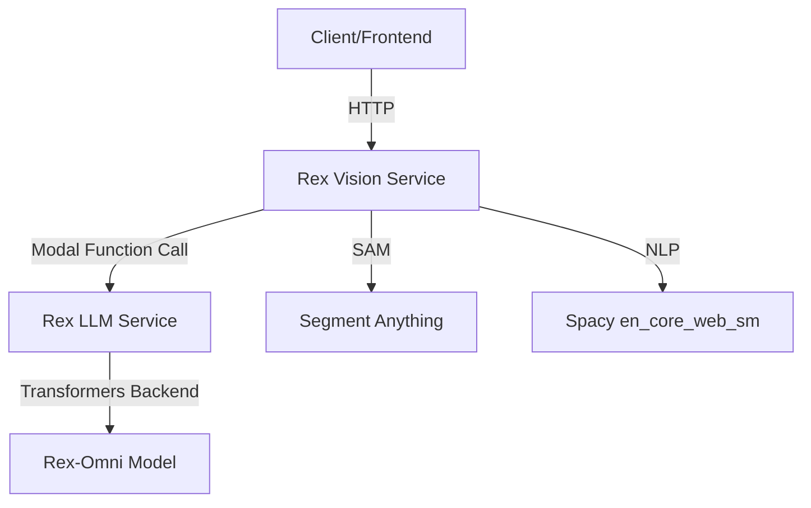

# Rex-Omni Modal Deployment Guide

## Architecture Overview

The Rex-Omni application is deployed as **two independent microservices** on Modal:



### Service 1: Rex LLM Service (`rex_llm_app.py`)

**Purpose:** Pure Rex-Omni inference using Hugging Face Transformers backend

**Resources:**
- GPU: A100-80GB (80GB VRAM)
- CPU: 32 vCPUs
- RAM: 128 GB
- Timeout: 600s
- Scaledown: 300s

**Model Configuration:**
- Model: `IDEA-Research/Rex-Omni` (non-quantized)
- Backend: `transformers` (HuggingFace)
- Quantization: None (disabled due to autoawq compatibility)
- Precision: bfloat16 (default)

**Dependencies:**
- PyTorch 2.6.0 + CUDA 12.4
- Transformers (latest)
- Accelerate
- Flash Attention 2.7.4
- NumPy < 2.1 (for compatibility)
- Numba < 0.61

**Endpoints:**
- `POST /rex_inference` - https://animeshraj958--rex-llm-service-rex-inference.modal.run

### Service 2: Rex Vision Service (`rex_vision_app.py`)

**Purpose:** SAM segmentation + Spacy NLP + orchestration

**Resources:**
- GPU: A100-40GB (40GB VRAM)
- CPU: 16 vCPUs
- RAM: 64 GB
- Timeout: 600s
- Scaledown: 300s

**Dependencies:**
- Segment Anything (SAM ViT-H)
- Spacy + en_core_web_sm
- OpenCV
- NumPy, Shapely, Matplotlib

**Endpoints:**
- `POST /api_sam` - SAM-enhanced detection
- `POST /api_grounding` - Phrase grounding with Spacy

---

## Deployment Steps

### Prerequisites

1. **Modal account** with GPU access
2. **Modal CLI** installed: `pip install modal`
3. **Authentication**: `modal token new`

### Step 1: Deploy LLM Service (**Deploy First!**)

```bash
cd /home/bakasur/Desktop/Rex-Omni
modal deploy rex_llm_app.py
```

**Expected output:**
```
✓ Created objects.
├── 🔨 Created mount /home/bakasur/Desktop/Rex-Omni/rex_llm_app.py
├── 🔨 Created mount /home/bakasur/Desktop/Rex-Omni/rex_omni
├── 🔨 Created web function rex_inference
└── 🔨 Created function RexLLMService.*
✓ App deployed in ~360s! 🎉
```

**Build time:** ~6 minutes (includes flash-attn compilation)

**First invocation:** ~2-3 minutes (model download: ~15GB)

### Step 2: Deploy Vision Service

```bash
modal deploy rex_vision_app.py
```

**Expected output:**
```
✓ Created objects.
├── 🔨 Created mount /home/bakasur/Desktop/Rex-Omni/rex_vision_app.py
├── 🔨 Created web function api_sam
└── 🔨 Created web function api_grounding
✓ App deployed in ~150s! 🎉
```

**Build time:** ~3 minutes (includes SAM checkpoint download: 2.5GB)

---

## Testing

### Test LLM Service Directly

```bash
# Encode image
IMAGE_B64=$(base64 -w 0 tutorials/detection_example/test_images/cafe.jpg)

# Test detection
curl -X POST https://animeshraj958--rex-llm-service-rex-inference.modal.run \
  -H "Content-Type: application/json" \
  -d "{
    \"image\": \"$IMAGE_B64\",
    \"task\": \"detection\",
    \"categories\": [\"person\", \"cup\", \"laptop\"]
  }" | jq
```

**Expected response:**
```json
{
  "success": true,
  "task": "detection",
  "extracted_predictions": {
    "person": [
      {"type": "box", "coords": [x1, y1, x2, y2]}
    ],
    "cup": [...],
    "laptop": [...]
  },
  "inference_time": 1.23,
  "num_output_tokens": 45,
  "generation_time": 0.98
}
```

### Test Vision Service (SAM)

```bash
curl -X POST https://animeshraj958--rex-vision-service-api-sam.modal.run \
  -H "Content-Type: application/json" \
  -d "{
    \"image\": \"$IMAGE_B64\",
    \"categories\": [\"person\", \"laptop\"]
  }" | jq
```

**Expected response:**
```json
{
  "success": true,
  "predictions": {...},
  "sam_results": [
    {
      "category": "person",
      "box": [x1, y1, x2, y2],
      "score": 0.95,
      "polygons": [[x1,y1,x2,y2,...]]
    }
  ]
}
```

### Test Grounding

```bash
curl -X POST https://animeshraj958--rex-vision-service-api-grounding.modal.run \
  -H "Content-Type: application/json" \
  -d "{
    \"image\": \"$IMAGE_B64\",
    \"caption\": \"A person sitting at a desk with a laptop\"
  }" | jq
```

---

## Monitoring & Logs

### View Live Logs

```bash
# LLM service logs
modal app logs rex-llm-service --follow

# Vision service logs
modal app logs rex-vision-service --follow
```

### Check Initialization

**LLM service should show:**
```
>>> ENTER RexLLMService.initialize()
Initializing transformers backend...
>>> Rex-Omni LLM initialized successfully
>>> rex_model set? True
```

**Vision service should show:**
```
>>> ENTER VisionService.initialize()
Initializing SAM...
>>> SAM initialized successfully
Initializing Spacy...
>>> Spacy initialized successfully
>>> VisionService initialization complete
```

---

## Troubleshooting

### Common Issues

#### 1. "AttributeError: object has no attribute 'rex_model'"

**Cause:** Modal lifecycle not calling `@enter()` method

**Solution:** 
- Ensure using `RexOmniService().method.remote()` pattern
- Don't create module-level instances
- Check deployment logs for initialization errors

#### 2. "ImportError: Numba needs NumPy 2.0 or less"

**Cause:** Dependency version conflict

**Solution:** Already fixed with force-reinstall in image build
```python
"pip install --force-reinstall --no-deps 'numpy<2.1' 'numba<0.61'"
```

#### 3. "RuntimeError: Cannot re-initialize CUDA in forked subprocess"

**Cause:** vLLM v1 engine multiprocessing issue

**Solution:** Using transformers backend instead
```python
backend="transformers"  # Not vllm
```

#### 4. "ValueError: autoawq version incompatible"

**Cause:** autoawq/transformers API mismatch

**Solution:** Disabled quantization
```python
quantization=None  # No AWQ for transformers
```

#### 5. "Runner ran out of memory, exit code: 137"

**Cause:** Insufficient RAM/VRAM

**Solution:** 
- LLM service: 128GB RAM, A100-80GB
- Vision service: 64GB RAM, A100-40GB

#### 6. "ModuleNotFoundError: No module named 'rex_llm_app'"

**Cause:** Vision service trying to import at build time

**Solution:** Using `modal.Function.lookup()` for runtime resolution
```python
rex_func = modal.Function.lookup("rex-llm-service", "rex_inference")
```

---

## Performance Characteristics

### LLM Service

| Metric | Value |
|--------|-------|
| **Cold start** | ~2-3 minutes (first invocation) |
| **Warm start** | ~1-2 seconds |
| **Inference time** | ~1-3 seconds (depends on prompt) |
| **Model size** | ~15 GB (bfloat16) |
| **Tokens/sec** | ~30-50 (transformers backend) |

### Vision Service

| Metric | Value |
|--------|-------|
| **Cold start** | ~30 seconds |
| **Warm start** | <1 second |
| **SAM inference** | ~2-5 seconds (depends on #boxes) |
| **Total pipeline** | 3-8 seconds (LLM + SAM) |

---

## Cost Optimization

### Auto-Scaling

Both services auto-scale to zero after 300 seconds of inactivity:
```python
scaledown_window=300
```

### Right-Sizing

**LLM Service:** 
- Heavy GPU usage, light CPU
- Could reduce to A100-40GB if not using long contexts

**Vision Service:**
- SAM needs GPU but lighter than LLM
- Could use A10G or T4 if budget-constrained

---

## Known Limitations

1. **No vLLM backend** - Using transformers due to Modal CUDA fork issues
2. **No AWQ quantization** - Disabled due to dependency conflicts
3. **Slower than optimized vLLM** - Acceptable trade-off for stability
4. **First request slow** - Model download + compilation (~2-3 min)

---

## Migration from Monolithic App

If migrating from old `modal_app.py`:

1. **Stop old deployment:**
   ```bash
   modal app stop rex-omni-service
   ```

2. **Deploy new services:**
   ```bash
   modal deploy rex_llm_app.py
   modal deploy rex_vision_app.py
   ```

3. **Update client URLs:**
   - OLD: `https://...--rex-omni-service-api-inference.modal.run`
   - NEW: `https://...--rex-vision-service-api-sam.modal.run`

---

## Future Improvements

### Short-term

- [ ] Test vLLM once Modal fixes CUDA fork handling
- [ ] Re-enable AWQ quantization when autoawq is compatible
- [ ] Add request batching for throughput optimization

### Long-term

- [ ] Implement caching layer for repeated queries
- [ ] Add multi-model support (different Rex variants)
- [ ] Integrate observability (Prometheus/Grafana)
- [ ] Add rate limiting and authentication

---

## Support

**Modal Documentation:** https://modal.com/docs  
**Rex-Omni GitHub:** https://github.com/IDEA-Research/Rex-Omni  
**Issues:** Check Modal logs first, then file issues

**Deployment verified:** 2025-11-23  
**Modal Version:** Latest (as of deployment)  
**Python Version:** 3.10
